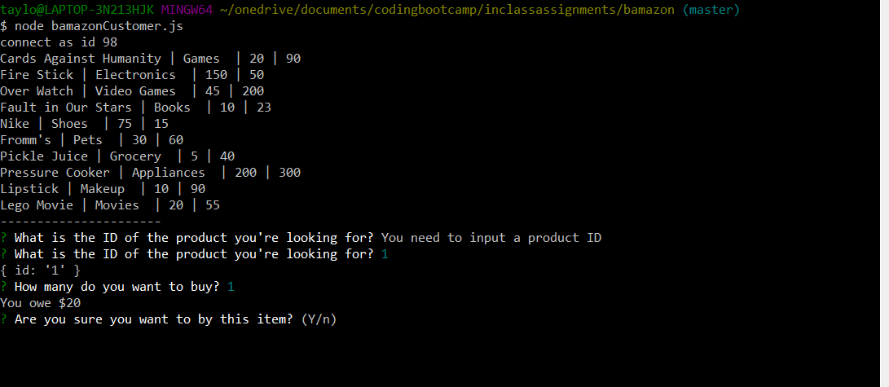

# bamazon

The Bamazon Application is a storefront that provides the consumer with all the items that we have in stock. Along with the items, the user is provided with the names, prices, categories, and the amount we have in stock. The user is then prompted to choose which item they want to buy. After they choose an item, they are then asked how many they want. If the amount they request is available, they are given the amount they owe, if that amount is unavailable, then they are given the store's inventory again. Before purchasing their item, the store will ask the customer if they are sure about their order so that they can ensure they requested the correct item and quantity. 
This application uses MySQL and node to present the storefront to the user.

